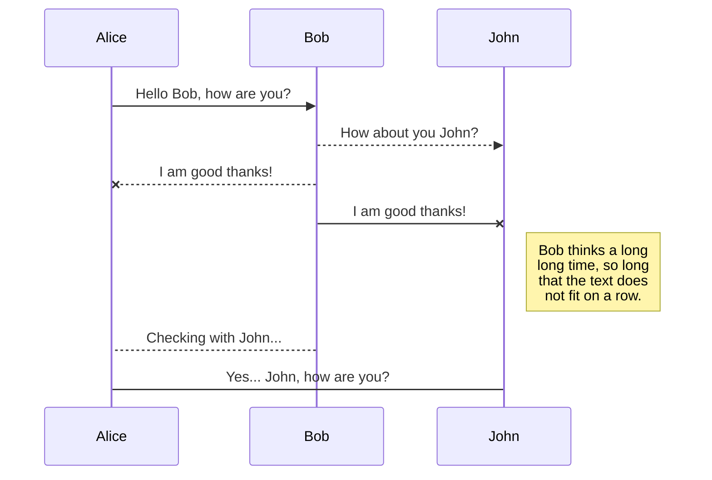
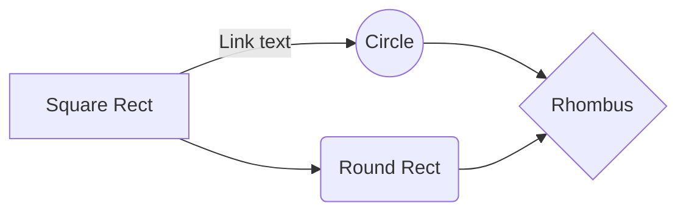

# Sonarr-IFTTT-Plex
A simple script to send push notifications from Sonarr to your mobile device using IFTTT with Plex deep linking support.

# Usage

## 1. Setting up IFTTT

### 1a. Getting IFTTT Webhooks API Key

## 2. Getting Plex API info

https://support.plex.tv/articles/204059436-finding-an-authentication-token-x-plex-token/
https://forums.plex.tv/discussion/129922/how-to-request-a-x-plex-token-token-for-your-app/p1

### 2a. Get Plex API Key
Invoke-RestMethod -URI "http://192.168.2.201:32400/library/sections?X-Plex-Token=$PlexToken";
response = Invoke-RestMethod -URI "http://plex.compmix.xyz/library/sections/7/all?X-Plex-Token=$PlexToken";
response = Invoke-RestMethod -URI "http://192.168.2.201:32400/library/metadata/11115?X-Plex-Token=$PlexToken";

### 2b. Get TV Show section key

## 3. Setting up Sonarr
host:port/settings/connect
Create a new Custom Connection
C:\Windows\System32\WindowsPowershell\v1.0\powershell.exe
-ExecutionPolicy Bypass -File C:\sonarr\custom_scripts\ifttt-webhook-on-event.ps1

## References

https://forums.plex.tv/discussion/286545/deep-links
https://github.com/Sonarr/Sonarr/wiki/Custom-Post-Processing-Scripts
https://support.plex.tv/articles/201638786-plex-media-server-url-commands/
https://support.plex.tv/articles/204059436-finding-an-authentication-token-x-plex-token/
# Markdown extensions

StackEdit extends the standard Markdown syntax by adding extra **Markdown extensions**, providing you with some nice features.

> **ProTip:** You can disable any **Markdown extension** in the **File properties** dialog.

## SmartyPants

SmartyPants converts ASCII punctuation characters into "smart" typographic punctuation HTML entities. For example:

|                |ASCII                          |HTML                         |
|----------------|-------------------------------|-----------------------------|
|Single backticks|`'Isn't this fun?'`            |'Isn't this fun?'            |
|Quotes          |`"Isn't this fun?"`            |"Isn't this fun?"            |
|Dashes          |`-- is en-dash, --- is em-dash`|-- is en-dash, --- is em-dash|

## KaTeX

You can render LaTeX mathematical expressions using [KaTeX](https://khan.github.io/KaTeX/):

The *Gamma function* satisfying $\Gamma(n) = (n-1)!\quad\forall n\in\mathbb N$ is via the Euler integral

$$
\Gamma(z) = \int_0^\infty t^{z-1}e^{-t}dt\,.
$$

> You can find more information about **LaTeX** mathematical expressions [here](http://meta.math.stackexchange.com/questions/5020/mathjax-basic-tutorial-and-quick-reference).

## UML diagrams

You can render UML diagrams using [Mermaid](https://mermaidjs.github.io/). For example, this will produce a sequence diagram:

And this will produce a flow chart:

